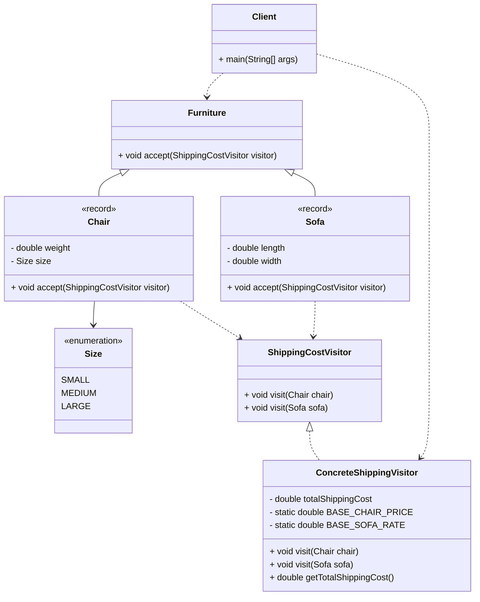

# Visitor Design Pattern

You are a software developer working on an e-commerce platform that sells various
types of furniture (chairs, tables, sofas, etc.). You want to implement a
functionality that calculates the shipping cost based on the furniture type
and size.

Each furniture type might have its own unique shipping cost calculation logic.
For example, chairs might be lightweight and have a flat shipping rate, while
sofas might be bulky and require a distance-based shipping cost calculation.
Implementing separate shipping logic within each furniture class would lead to
tight coupling and difficulty adding new furniture types in the future.

Implement a visitor design pattern approach. You must show the different elements
of visitor design in your solution.  DO NOT USE ABSTRACT CLASSES. You are free to
name your interfaces and concrete classes. Have a client code that will test your
program.

# UML Diagram

[Paste the code here](https://mermaid.live)

